# Transformer Architecture Project

This project implements and explores the Transformer architecture, a deep learning model widely used in natural language processing (NLP) and other machine learning tasks.

# Transformer Architecture

A visual and textual breakdown of the Transformer model architecture, introduced in the paper ["Attention is All You Need"](https://arxiv.org/abs/1706.03762). This README provides a clear and concise flow chart of the architecture along with explanations of each component. This is fundamental for applications in **Natural Language Processing (NLP)**, **Large Language Models (LLMs)**, **Machine Translation**, **Text Summarization**, and **Text Generation**.

---

## 🧠 Transformer Architecture Overview

```mermaid
flowchart LR
    A[Input Tokens] --> B[Token Embeddings]
    B --> C[+ Positional Encoding]
    C --> D[Encoder Block × N]
    D --> E[Encoder Output]

    subgraph Encoder Block
        D1[Multi-Head Self-Attention]
        D2[Add & Norm]
        D3[Feed Forward]
        D4[Add & Norm]
        D1 --> D2 --> D3 --> D4
    end

    E --> F[Decoder Block × N]
    F --> G[Linear + Softmax → Output Tokens]

    subgraph Decoder Block
        F1[Masked Multi-Head Self-Attention]
        F2[Add & Norm]
        F3[Encoder-Decoder Attention]
        F4[Add & Norm]
        F5[Feed Forward]
        F6[Add & Norm]
        F1 --> F2 --> F3 --> F4 --> F5 --> F6
    end
```

